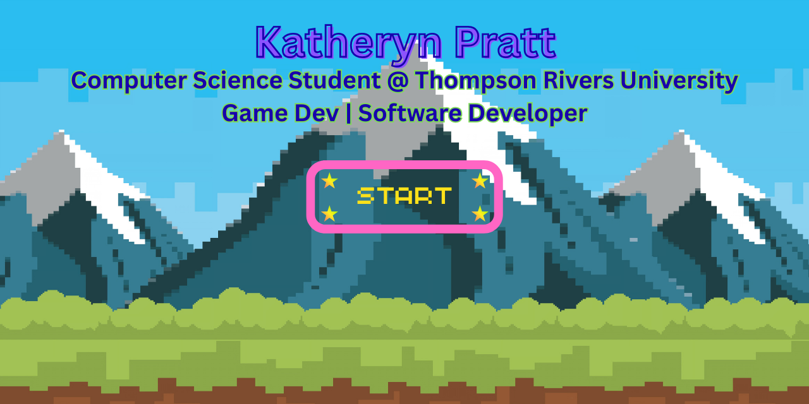
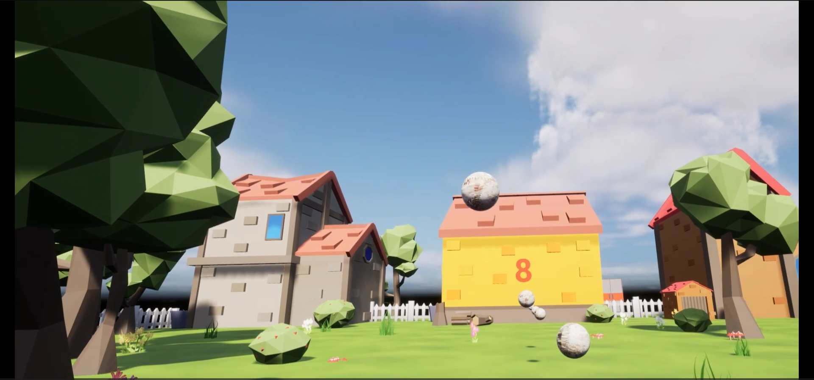
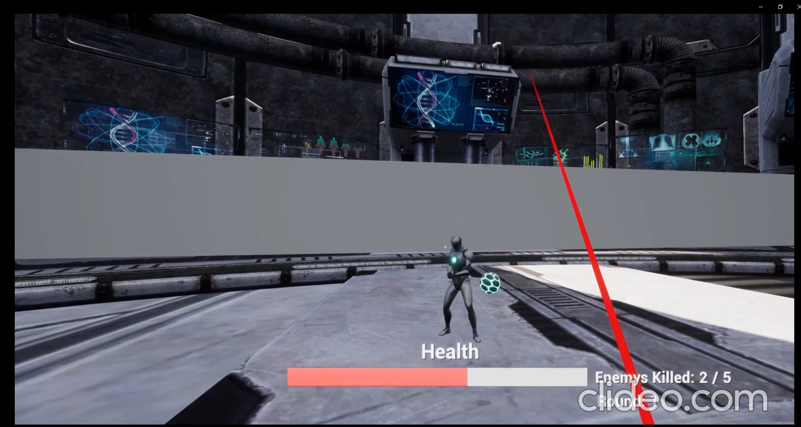
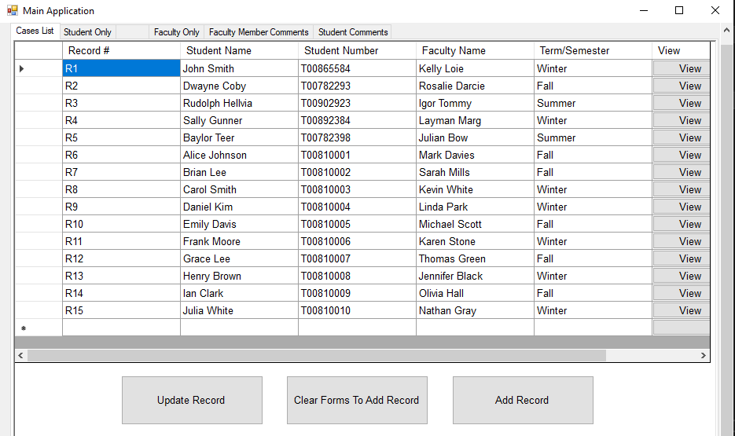
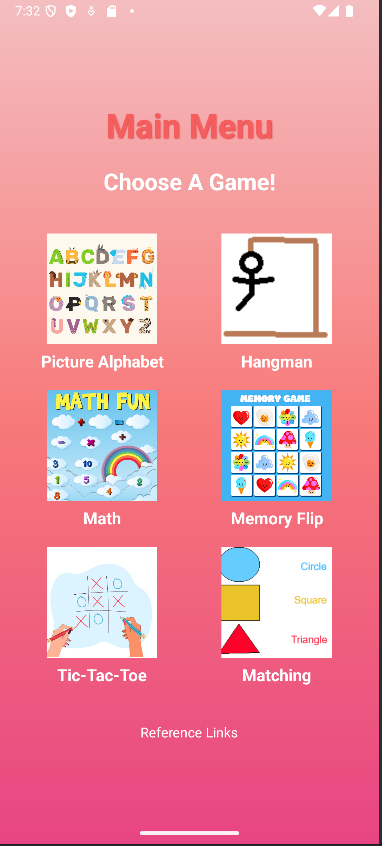
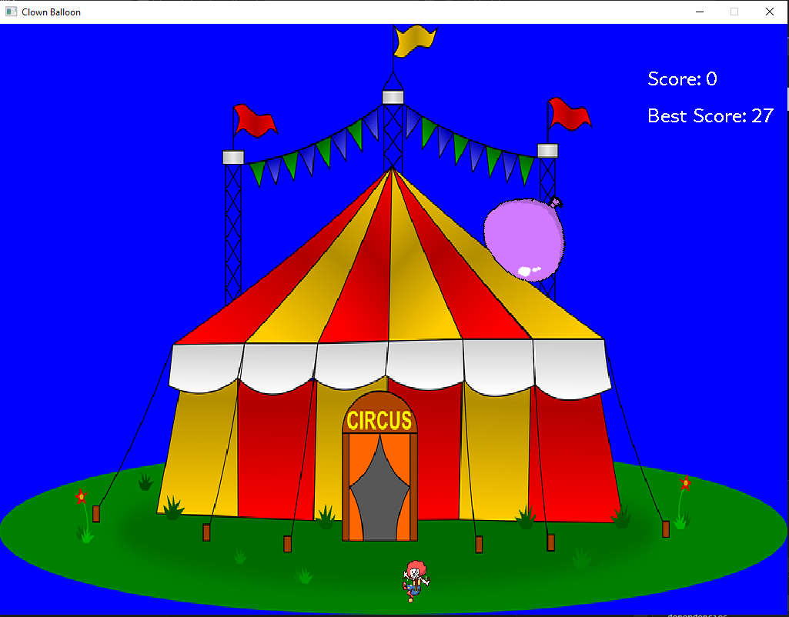
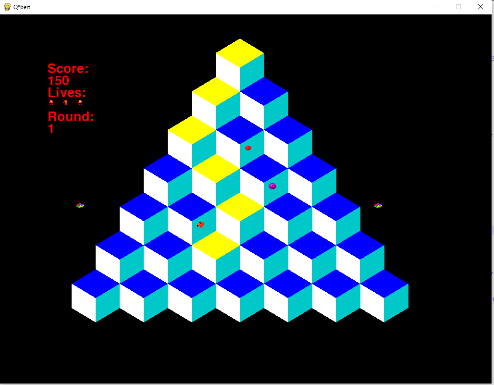
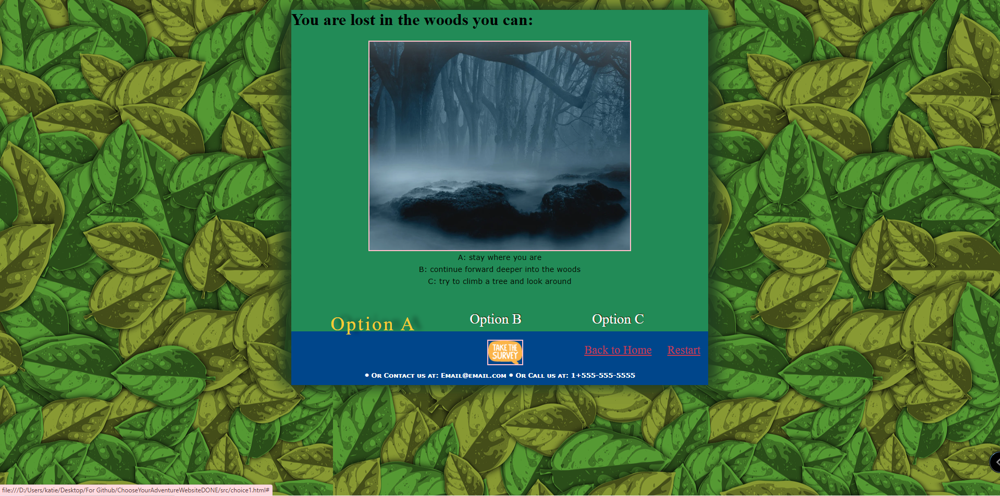

## About Me
I'm a 4th year Computing Science Co-op student who loves all things code, games, and creative problem solving. 
- 🎓 Studying Computing Science at **Thompson Rivers University**, Kamloops BC
- 🕹️ Passionate about **game development and software engineering**
- 🌱 Currently learning **SQL, Power BI, and Computer Networks**
- 🔍 Actively seeking **co-op opportunities** in software development, game dev, and IT

## 🛠️ Languages & Tools

## 📊 GitHub Stats

  
  

  

 

## 🎮 Featured Projects
### 🥽 VR Baseball & Space Shooter *(Unreal Engine, C++, Blueprints)*
Two VR experiences built in Unreal Engine.

### 🗂️ Academic Case Record Manager *(C#, Windows Forms, Python, JSON)*
A desktop GUI application with a Python backend. Built collaboratively.

### 📱 Tiny Thinkers — Mobile Educational Game Suite *(Android Studio, Java)*
A collaborative Android app featuring authentication and mini-games built for young learners.

### 🎪 Clown Game (C++)*
2D arcade-style game where you play as a clown trying to pop a bouncing balloon with a dart before it hits you, or the ground. 

### @!#?@! Q*bert Clone *(Python, Pygame)*
A clone of the classic Q-bert arcade game built using Python and Pygame.

### 🏰 Choose Your Own Adventure Website *(HTML, CSS, Javascript)*
A local fake "Choose Your Own Adventure" website.

## 🤝 Connect With Me

*"Don't you dare go hollow."* 🎮

